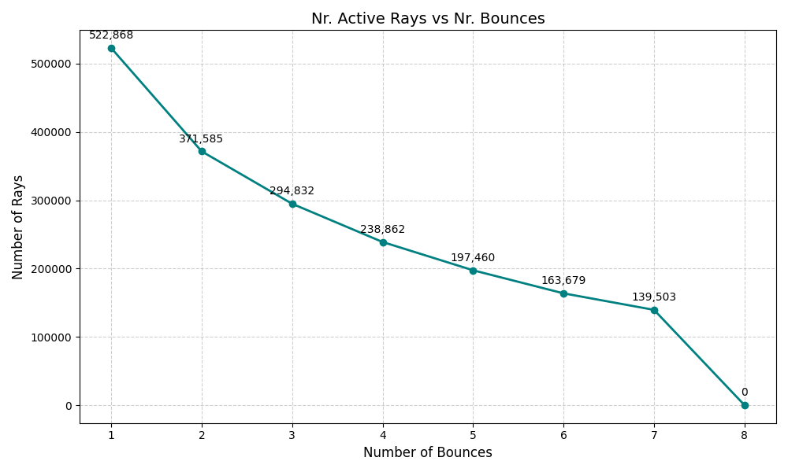

**University of Pennsylvania, CIS 5650: GPU Programming and Architecture, Project 3**

* Yannick Gachnang
  * [LinkedIn](https://www.linkedin.com/in/yannickga/)
* Tested on: Windows 10, EPYC 9354 @ 3.25GHz, 16GB RAM, RTX 2000 Ada 23GB VRAM

Project 3 CUDA Path Tracer
====================

## Basic Features

### Diffuse BSDF

<br>

---

### Stream Compaction

This path tracer implements stream compaction which moves active rays to the front of the array and dead rays to the back, allowing later kernel launches to process only the active rays rather than the full array.

#### Implementation

The compaction is done in three steps.
1. Map rays to boolean flags (1 for alive, 0 for dead).
2. Perform an exclusive scan on the flags to compute output indices.
3. Scatter rays to their final positions.
The scan is implemented using Blelloch's work-efficient algorithm with shared memory optimizations.
Each block processes a tile of elements entirely in shared memory and computes partial sums that get recursively scanned if multiple blocks are needed.

#### Performance

The graph below shows how the number of active rays evolves with bounce depth when compaction is enabled. The ray count decreases somewhat linearly from 522,868 to just 139,503 before reaching zero at the last bounce. 
This happens because rays miss geometry or are terminated early (with Russian Roulette for example, which was not enabled for this). The idea is that by compacting the ray array after each bounce, only the surviving rays are processed in the next iteration which allows for smaller kernel launches and ideally a faster total execution times.


<br>
<sub>*Number of active rays in the array after compaction during the very first iteration*</sub>

The graph below shows the execution time of individual kernels with and without compaction across all bounce depths.
Without compaction, each kernel processes the full array of 640,000 rays resulting in consistent intersect and shade times that hover around 0.6 to 1.3 ms per bounce.
Since the ray count remains fixed, there's no need for compaction, and the total frame time settles at a lean 14.157 ms.

With compaction enabled the intersect and shade kernels do benefit from reduced ray counts. For example, intersect time drops from 0.6765 ms at depth 1 to just 0.3553 ms at depth 8, and shade time falls from 0.6809 ms to 0.2920 ms over the same range.
However, these savings are completely overshadowed by the cost of the compaction step itself, which adds between 0.9 and 3.3 ms per bounce. At depth 5, for instance, compaction takes 3.2678 ms—more than five times the combined cost of intersect and shade at that depth. 
This overhead accumulates quickly, leading to the total frame time ballooning to 21.279 ms which is around 60% slower than the uncompacted baseline.


<br>
<sub>*Time in ms for the different kernels in the main loop with and without compaction during the very first iteration*</sub>

While this version uses shared memory, testing against the non-shared memory version makes the situation even worse. The total frame time spikes to 23.372 ms, as the kernel time for compaction almost doubles.
Thus both work-efficient stream compaction implementations (adapted from Project 2) do not offer a substantial benefit here.

#### GPU vs CPU

Parallel scan and scattering are operations that can be parallelized and with proper implementation (like `thrust` does) run super fast. While modern CPUs can keep up for smaller arrays, the sequential nature of CPUs tends to favor GPUs for larger arrays.

#### Further Optimizations

The current implementation allocates temporary buffers for flags and indices on every compaction call. Reusing pre-allocated buffers would reduce overhead.
More importantly however, compaction becomes unnecessary with the wavefront architecture (see below), which naturally achieves compaction through its queue-based design.
Therefore the conclusion in this project was, that time would be better spent on another optimization that eliminates the need for compaction altogether while at the same time improving coherence between threads!

---
<br>

### Material Sorting

---
<br>

### Anti-Aliasing

---
<br><br>

## Visual Features

### Specular and Refractive Materials

This path tracer implements specular reflective materials and basic refractive materials (no glossy materials or roughness).

| Diffuse Sphere | Refractive Sphere | Specular Sphere |
| --- | --- | --- |
|  |  |  |

#### Implementation

For specular reflection, the standard mirror reflection formula to compute the outgoing direction as a pure reflection about the surface normal are used.
For refractive materials, Snell's law with Fresnel reflection coefficients computed via Schlick's approximation are used.
At each surface interaction, the code chooses between reflection and refraction based on the Fresnel term and when total internal reflection occurs the ray reflects specularly.
Otherwise it refracts according to the ratio of refractive indices.

Both specular and refractive interactions are marked as delta distributions for the MIS implementation later.

#### Performance

The frametimes for the different materials for this simple scene are within 5%, with specular doing marginally better probably because of its deterministic, non-branching computation path.
Scaling this up to 3 scenes, reveals that they all scale at approximately the same rate for increasing scene complexity.
This is the expected behavior, since in all cases the ray gets manipulated (scattered, reflected, transmitted) and then continues onward.
Performance is expected to get worse as more geometry is added into a scene and it appears that the material type does not substantial affect this scaling.


<br>
<sub>*Bar chart showing the performance differences between the material types and how they scale with adding more objects of the same type*</sub>

<details>
  <summary>Raw Data</summary>
  

| Number of spheres | Diffuse (ms/frame) | Refractive (ms/frame) | Specular (ms/frame) |
|-------|-------------------|---------------------|---------------------|
| 1     | 22.70             | 23.15               | 22.66               |
| 2     | 23.547            | 24.01               | 23.51               |
| 3     | 24.531            | 25.02               | 24.42               |

</details>

#### GPU vs CPU

Diffuse shading only needs to accumulate the color throughput and calculate a new direction for the ray which is easily parallelizable with little memory contention. The two new material type have the same scope shading work, so aside from the divergence problems mentioned above they benefit similarly from parallel execution. A CPU implementation would process these rays sequentially and lose the massive throughput advantage and even the branching problems on the GPU are greatly overshadowed by processing thousands of rays at the same time.

#### Further Optimizations

While scaling in a simple scene appears to not be affected by material type, there are cases where this can be problematic. As long as shading is done in a single monolithic kernel, there will be divergence between the threads due to different branching conditions that could cause additional slowdown. 
This can be counteracted by sorting the rays by material type before shading or using a queue based system where each material gets sorted into its own queue (wavefront). Both of these will be investigated further below.

Implementing glossy and rough specular materials would greatly enhance the variety of scenes that can be represented, though it would also introduce additional calculations and branching that could negatively impact performance

---
<br>

### Sampling Methods

This path tracer implements stratified sampling with cranley-patterson rotation and low-discrepancy Sobol sequences, both of which aim to reduce variance and improve sample distribution.
Uniform random sampling can sometimes struggle with subtle low-contrast features like penumbras, an area that both methods aim to address.

| Uniform random sampling | Stratified + Sobol sampling |
| --- | --- |
|  |  |

#### Implementation

Stratified sampling divides each sample dimension into temporal strata across iterations rather than spatial strata within a single pixel (since we're shooting one ray per pixel per iteration).
Each iteration draws from a different stratum in the sequence, with Cranley-Patterson rotation applied per-pixel to prevent structured patterns from forming across the image.
This ensures more even coverage of the sample space over time.

Sobol sampling is a quasi-random low-discrepancy sequence that theoretically provides better convergence than pseudorandom sampling.
The same Sobol sampling is also used in the diffuse shader for hemisphere sampling and in shadow ray generation for light sampling, so the toggle affects sampling throughout the entire path tracer.

For the random number generator, the `thrust::default_random_engine rng = makeSeededRandomEngine(iter, index, 0);` was upgraded to an xorshift32 based generator for slightly faster random sampling.

#### Performance

The performance impact is negligible as all sampling strategies stay within 1% frametime of each other at various sample counts. Therefore, as long as Sobol (+ stratified) sampling generally produces an equivalent or better result than uniform random sampling, it can always be enabled without a meaningful negative impact.

More interestingly, variance calculations also show no meaningful difference between Sobol sampling and uniform random sampling (<1% difference) in most cases.
This can likely be attributed to the simplicity of most of the tested scenarios.
Only in more complicated scene setups do some of the subtle differences show up like the penumbra becoming slightly more visible in the pictures above.
This particular scene was setup on purpose to produce soft shadows with an area light to highlight where Sobol (+ stratified) sampling can help, but also showcases that this feature becomes more important as scene complexity increases.

#### GPU vs CPU

Both sampling methods work well on GPU. The sampling computation is uniform across all rays with no divergence. A CPU implementation would be slower due to sequential processing with no architectural advantage.

#### Further Optimizations

Adaptive sampling which concentrates samples in high-variance regions or other spatially aware sampling methods would likely much more explicitly lower variance faster than Sobol sampling.

---
<br>

### Depth of Field

This path tracer implements various real world camera properties like f-stop, focal length and focal distance to simulate depth of field (colloquially known as bokeh effect).

| Pinhole Camera | f/8 | f/2.8 |
| --- | --- | --- |
|  |  |  |

#### Implementation

Each camera ray originates from a randomly sampled point on a circular aperture rather than a single pinhole.
The code first computes the standard pinhole ray direction, then calculates where this ray intersects the focal plane.
The ray origin then gets offset to a point on the lens, and the direction gets recomputed to pass through the focal point.
The f-stop controls the lens radius, with lower f-numbers producing shallower depth of field. The focal length values were scaled arbitrarily for this demonstration.
With proper physical units the scaling factor would need to be adjusted to match real-world camera behavior, but the f-stop values themselves don't really mean anything with unitless scene dimensions.

#### Performance

The depth of field calculation introduces negligible overhead with a <1% measured performance difference, likely because the additional per-ray calculations are lightweight compared to ray-scene intersection and shading.

#### GPU vs CPU

Every ray undergoes identical lens sampling calculations with no branching, which results in perfect coherence across warps. The math is simple and uniform so the GPU can process all rays in parallel. A CPU version would offer no advantages and would be significantly slower due to sequential processing.

#### Further Optimizations

More sophisticated lens models (thick lens simulation or realistic optical systems) could enhance realism, but would incur slightly increased computational cost.

---
<br><br>

## Mesh Improvements

### OBJ File Loading

The path tracer supports loading arbitrary triangle meshes from `.obj` files, to expand the range of geometry that can be rendered beyond the basic primitives.


#### Implementation

The loader uses tinyobjloader to parse `.obj` files and their associated `.mtl` material definitions.
When a mesh object is specified in the scene `.json` file, the loader reads the OBJ file, extracts vertex positions and normals and creates individual triangle geometry for each face.
The code applies transformation matrices specified in the scene description to all vertices and normals to allow for easy manipulation within the scene.

If the `.json` specifies a material override (e.g. ` "MATERIAL": "diffuse_white"`), all triangles use that material.
Otherwise, the loader parses the `.mtl` file, extracts material properties and adds the material to the internal material system.
If a triangle has no assigned material, it gets a default gray diffuse material.
Textures, glossy materials and roughness are currently not supported and will be ignored upon parsing the file.

To include an `.obj` mesh in a scene, add an object entry to the scene `.json` like this:

```json
{
  "TYPE": "mesh",
  "FILE": "models/teapot.obj",
  "MATERIAL": "DiffuseWhite",
  "TRANS": [0, 0, 0],
  "ROTAT": [0, 0, 0],
  "SCALE": [1, 1, 1]
}
```

The `FILE` path is relative to the scene file location. The `MATERIAL` field is optional and determines the material override.

#### Performance

Without spatial acceleration, mesh rendering performance drops off a cliff.
The Utah teapot (about 3.5k triangles) example above runs at 676.5 ms/frame compared to the baseline cornell box at 36.3 ms/frame.
This makes sense since every ray tests intersection against every triangle with 3,500 brute force intersection tests per ray per bounce instead of the handful of primitives in the basic scenes.
This is completely unusable for any practical rendering without a spatial data structure.

#### GPU vs CPU

Triangle intersection tests benefit from running on the GPU similar to sphere and cube intersection tests, it can be run in parallel easily.
A CPU implementation on the other hand, would face the same algorithmic complexity but process rays sequentially, making it even slower.
But the real bottleneck here isn't the architecture, it's the $O(n \cdot m)$ (n rays, m triangles) intersection tests.

#### Further Optimizations

The current implementation lacks texture coordinate and UV mapping support, so all materials use flat colors instead of textured meshes.
The material system also doesn't support more advanced features like roughness or glossy reflections, which means everything is either perfectly diffuse, perfectly specular, or refractive.
The loader currently creates one `Geom` per triangle, which is memory intensive for large meshes.
A more efficient approach would store vertices in a separate array and have triangles reference indices for a smaller memory footprint.

---
<br><br>

## Performance Features

### Russian Roulette

---
<br>

### Hierarchical Spatial Data Structure

---
<br>

### Wavefront Path Tracing

---
<br>
