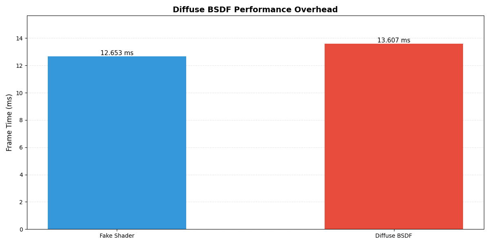
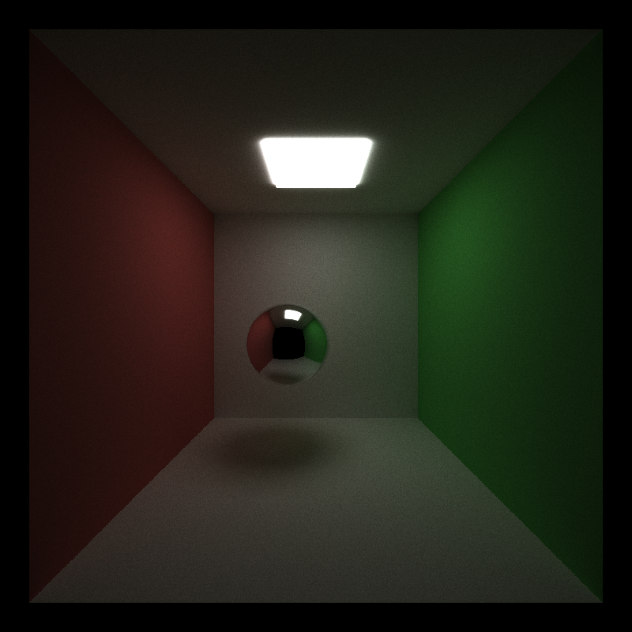

**University of Pennsylvania, CIS 5650: GPU Programming and Architecture, Project 3**

* Yannick Gachnang
  * [LinkedIn](https://www.linkedin.com/in/yannickga/)
* Tested on: Windows 10, EPYC 9354 @ 3.25GHz, 16GB RAM, RTX 2000 Ada 23GB VRAM

Project 3 CUDA Path Tracer
====================

This project implements a CUDA-based path tracer with various features and optimizations.
The implementation supports diffuse, specular, and refractive materials, stochastic anti-aliasing, and direct lighting with multiple importance sampling.
Advanced camera effects such as depth of field are modeled after real optics.
Performance features include work-efficient stream compaction, material sorting, Russian Roulette path termination, LBVH acceleration structure for fast mesh intersection and a wavefront path tracing architecture to maximize GPU coherence across different material types.


<br>
<sub>*Sponza model rendered at 8096spp with textures mapped to diffuse and specular materials. Render performance at around ~872 ms/frame, total time ~2 hours.*</sub>

## Basic Features

### Diffuse BSDF

The diffuse BSDF implements Lambertian reflection using cosine-weighted hemisphere sampling.
When a ray hits a diffuse surface, the shader generates a new direction by sampling the hemisphere oriented around the surface normal. 

| "Fake" Shader | Diffuse BSDF |
| --- | --- | 
|  |  |

#### Implementation

Two random samples generate a point on the hemisphere weighted towards the normal.
The BSDF PDF is computed as $\cos(\theta) / \pi$ where $\theta$ is the angle between the normal and the outgoing direction.
The path throughput then gets multiplied by the material color to accumulate color information until it hits a light when it gets deposited.
With Sobol sampling enabled, the random samples come from the quasi-random sequence instead of the PRNG.

#### Performance

For the simple cornell box scene above, the diffuse BSDF adds roughly 7.5% overhead compared to the baseline "fake" shader (12.7 ms/frame vs 13.6 ms/frame).
The fake shader emulates rasterizer style shading that terminates rays immediately after the first hit.
The diffuse BSDF overhead comes from hemisphere sampling, constructing the local coordinate frame, evaluating the BSDF PDF, and continuing the path through multiple bounces.
The cost is reasonable, given that the diffuse shader implements actual light transport while the fake shader just approximates surface appearance in a single pass.



#### GPU vs CPU

Diffuse sampling is perfectly suited for GPU.
Every ray undergoes identical sampling operations with no branching, which results in complete coherence across warps.
A CPU version would be slower due to sequential processing with no inherent advantage.

#### Further Optimizations

Implementing importance sampling for materials could be beneficial, as the sampling distribution could account for color variation across the surface.

<br>

### Stream Compaction

Stream compaction moves active rays to the front of the array and dead rays to the back, allowing later kernel launches in the path tracer to process only the active rays rather than the full array.

#### Implementation

The compaction is done in three steps.
1. Map rays to boolean flags (1 for alive, 0 for dead).
2. Perform an exclusive scan on the flags to compute output indices.
3. Scatter rays to their final positions.
The scan is implemented using Blelloch's work-efficient algorithm with shared memory optimizations.
Each block processes a tile of elements entirely in shared memory and computes partial sums that get recursively scanned if multiple blocks are needed.

#### Performance

The graph below shows how the number of active rays evolves with bounce depth when compaction is enabled in open and closed scenes.
In the open scene, the ray count decreases somewhat linearly from 605,026 to just 194,348 before reaching zero at the last bounce, which represents a roughly 60% decrease in the number of active rays. 
This happens because rays miss geometry or are terminated early when they hit a light emitter.
The idea is that by compacting the ray array after each bounce, only the surviving rays are processed in the next iteration which allows for smaller kernel launches and ideally a faster total execution times.
In the closed scene, rays persist across more bounces, which limits the relative benefit of compaction since fewer rays terminate early.


The graph below shows the execution time of individual kernels with and without compaction across all bounce depths.
Without compaction, each kernel processes the full array of 640,000 rays resulting in consistent intersect and shade times that hover around 0.6 to 1.3 ms per bounce.
Since the ray count remains fixed, there's no need for compaction, and the total frame time settles at a lean 14.157 ms.

With compaction enabled the intersect and shade kernels do benefit from reduced ray counts. For example, intersect time drops from 0.6765 ms at depth 1 to just 0.3553 ms at depth 8, and shade time falls from 0.6809 ms to 0.2920 ms over the same range.
However, these savings are completely overshadowed by the cost of the compaction step itself, which adds between 0.9 and 3.3 ms per bounce. At depth 5, for instance, compaction takes 3.2678 ms—more than five times the combined cost of intersect and shade at that depth. 
This overhead accumulates quickly, leading to the total frame time ballooning to 21.279 ms which is around 60% slower than the uncompacted baseline.


While this version uses shared memory, testing against the non-shared memory version makes the situation even worse. The total frame time spikes to 23.372 ms, as the kernel time for compaction almost doubles.
Thus both work-efficient stream compaction implementations (adapted from Project 2) do not offer a substantial benefit here.

#### GPU vs CPU

Parallel scan and scattering are operations that can be parallelized and with proper implementation (like `thrust` does) run super fast.
While modern CPUs can keep up for smaller arrays, the sequential nature of CPUs tends to favor GPUs for larger arrays.

#### Further Optimizations

The current implementation allocates temporary buffers for flags and indices on every compaction call. Reusing pre-allocated buffers would reduce overhead.
More importantly however, compaction becomes unnecessary with the wavefront architecture (see below), which naturally achieves compaction through its queue-based design.
Therefore the conclusion in this project was, that time would be better spent on another optimization that eliminates the need for compaction altogether while at the same time improving coherence between threads!

<br>

### Material Sorting

Material sorting attempts to reduce warp divergence by grouping rays by material type before shading, so that threads in a warp execute the same shader code.

#### Implementation

The implementation uses Thrust's sort by key to reorder rays based on their material ID.
An earlier version used the radix sort implementation from project 2, but even with shared memory optimizations it performed so poorly that it was pointless.

#### Performance

The graph below shows that sorting by material type increases shading coherence but introduces a constant sorting overhead of roughly 0.6 ms to 0.9 ms per bounce.
For this scene, the additional cost outweighs the divergence reduction, leading to an overall slower frame time despite more balanced shading workloads.
Concretely, sorting increased total frame time from 15.3 ms to 20.0 ms, primarily due to the overhead of the sorting step.


#### GPU vs CPU

Sorting benefits from GPU implementations as many operations can run in parallel.
However, material sorting is done to reduce warp divergence, which is not a problem on the CPU.
Thus, a CPU path tracer wouldn't implement material sorting.

#### Further Optimizations

As demonstrated further below, the wavefront architecture naturally groups rays by material type and eliminates the need for sorting entirely while keeping coherence.

<br>

### Anti-Aliasing

Anti-aliasing eliminates jagged edges on geometry by jittering ray origins within each pixel rather than always sampling from the pixel center.

| AA disabled | AA enabled |
| --- | --- |
|  |  |
<br>
<sub>*Anti-Aliasing smoothes out jagged edges along curved or diagonal edges. These comparisons highlight the difference AA makes (particularly where the circle approaches a perfectly horizontal or vertical line*</sub>

#### Implementation

Each sample adds a random offset within the pixel's unit square to the ray origin before computing the ray direction.
The offset comes from the PRNG by default, but with stratified or Sobol sampling enabled, those patterns affect the jitter distribution as well.

#### Performance

For anti-aliasing, the performance difference between enabled and disabled is effectively zero.
Across repeated runs on the various scenes, the frame time fluctuations overshadow any perceptible performance difference.
This makes sense since the additional work per ray only consists of generating two random offsets and adjusting the ray direction.

#### GPU vs CPU

Anti-aliasing adds negligible overhead with just a couple of random samples and arithmetic operations per ray with no branching.
A CPU implementation would be equally simple but slower due to its sequential nature.

#### Further Optimizations

---
<br><br>

## Visual Features

### Specular and Refractive Materials

Specular and refractive materials are implemented as delta-distribution BSDFs, allowing the tracer to simulate ideal mirror reflections and light transmission through dielectric surfaces with physically-accurate Fresnel effects.

| Diffuse Sphere | Refractive Sphere | Specular Sphere |
| --- | --- | --- |
|  |  |  |
<br>
<sub>*Showing the material capabilities of the tracer*</sub>

#### Implementation

For specular reflection, the standard mirror reflection formula to compute the outgoing direction as a pure reflection about the surface normal are used.
For refractive materials, Snell's law with Fresnel reflection coefficients computed via Schlick's approximation are used.
At each surface interaction, the code chooses between reflection and refraction based on the Fresnel term and when total internal reflection occurs the ray reflects specularly.
Otherwise it refracts according to the ratio of refractive indices.

Both specular and refractive interactions are marked as delta distributions for the MIS implementation later.

#### Performance

The frame times for the different materials for the simple cornell box scene above are within 5%, with specular doing marginally better probably because of its deterministic, non-branching computation path.
Scaling this up to 3 scenes, reveals that they all scale at approximately the same rate for increasing scene complexity.
This is the expected behavior, since in all cases the ray gets manipulated (scattered, reflected, transmitted) and then continues onward.
Performance is expected to get worse as more geometry is added into a scene and it appears that the material type does not substantially affect this scaling.


<br>
<sub>*Bar chart showing the performance differences between the material types and how they scale with adding more objects of the same type*</sub>

#### GPU vs CPU

Diffuse shading only needs to accumulate the color throughput and calculate a new direction for the ray which is easily parallelizable with little memory contention. The two new material type have the same scope shading work, so aside from the divergence problems mentioned above they benefit similarly from parallel execution. A CPU implementation would process these rays sequentially and lose the massive throughput advantage and even the branching problems on the GPU are greatly overshadowed by processing thousands of rays at the same time.

#### Further Optimizations

While scaling in a simple scene appears to not be affected by material type, there are cases where this can be problematic.
As long as shading is done in a single monolithic kernel, there will be divergence between the threads due to different branching conditions that could cause additional slowdown. 
This can be counteracted by sorting the rays by material type before shading or using a queue based system where each material gets sorted into its own queue (wavefront). Both of these will be investigated further below.

Implementing glossy and rough specular materials would greatly enhance the variety of scenes that can be represented, though it would also introduce additional calculations and branching that could negatively impact performance

<br>

### Sampling Methods

Stratified sampling with cranley-patterson rotation and low-discrepancy Sobol sequences aim to reduce variance and improve sample distribution.
Uniform random sampling can sometimes struggle with subtle low-contrast features like penumbras, an area that both methods aim to address.

| Uniform random sampling | Stratified + Sobol sampling |
| --- | --- |
|  |  |
<br>
<sub>*Penumbral shadows below the floating sphere are barely visible with sobol sampling but basically invisible with uniform sampling, though the difference is hard to spot*</sub>

#### Implementation

Stratified sampling divides each sample dimension into temporal strata across iterations rather than spatial strata within a single pixel (since we're shooting one ray per pixel per iteration).
Each iteration draws from a different stratum in the sequence, with Cranley-Patterson rotation applied per-pixel to prevent structured patterns from forming across the image.
This ensures more even coverage of the sample space over time.

Sobol sampling is a quasi-random low-discrepancy sequence that theoretically provides better convergence than pseudorandom sampling.
The same Sobol sampling is also used in the diffuse shader for hemisphere sampling and in shadow ray generation for light sampling, so the toggle affects sampling throughout the entire path tracer.

For the random number generator, the `thrust::default_random_engine rng = makeSeededRandomEngine(iter, index, 0);` was upgraded to an xorshift32 based generator for slightly faster random sampling.

#### Performance

The performance impact is negligible as all sampling strategies stay within 1% frame time of each other at various sample counts. Therefore, as long as Sobol (+ stratified) sampling generally produces an equivalent or better result than uniform random sampling, it can always be enabled without a meaningful negative impact.

More interestingly, variance calculations also show no meaningful difference between Sobol sampling and uniform random sampling (<1% difference) in most cases.
This can likely be attributed to the simplicity of most of the tested scenarios.
Only in more complicated scene setups do some of the subtle differences show up like the penumbra becoming slightly more visible in the pictures above.
This particular scene was setup on purpose to produce soft shadows with an area light to highlight where Sobol (+ stratified) sampling can help, but also showcases that this feature becomes more important as scene complexity increases.

#### GPU vs CPU

Both sampling methods work well on GPU. The sampling computation is uniform across all rays with no divergence. A CPU implementation would be slower due to sequential processing with no architectural advantage.

#### Further Optimizations

Adaptive sampling which concentrates samples in high-variance regions or other spatially aware sampling methods would likely much more explicitly lower variance faster than Sobol sampling.

<br>

### Depth of Field

This path tracer implements various real world camera properties like f-stop, focal length and focal distance to simulate depth of field (colloquially known as bokeh effect).

| Pinhole Camera | f/8 | f/2.8 |
| --- | --- | --- |
|  |  |  |
<br>
<sub>*Emulated depth of field for the tracer*</sub>

#### Implementation

Each camera ray originates from a randomly sampled point on a circular aperture rather than a single pinhole.
The code first computes the standard pinhole ray direction, then calculates where this ray intersects the focal plane.
The ray origin then gets offset to a point on the lens, and the direction gets recomputed to pass through the focal point.
The f-stop controls the lens radius, with lower f-numbers producing shallower depth of field. The focal length values were scaled arbitrarily for this demonstration.
With proper physical units the scaling factor would need to be adjusted to match real-world camera behavior, but the f-stop values themselves don't really mean anything with unitless scene dimensions.

#### Performance

The depth of field calculation introduces negligible overhead with a <1% measured performance difference, likely because the additional per-ray calculations are lightweight compared to ray-scene intersection and shading.

#### GPU vs CPU

Every ray undergoes identical lens sampling calculations with no branching, which results in perfect coherence across warps. The math is simple and uniform so the GPU can process all rays in parallel. A CPU version would offer no advantages and would be significantly slower due to sequential processing.

#### Further Optimizations

More sophisticated lens models (thick lens simulation or realistic optical systems) could enhance realism, but would incur slightly increased computational cost.

<br>

### Direct Lighting

Direct lighting with next event estimation (NEE) dramatically accelerates convergence by explicitly sampling light sources at each diffuse surface interaction rather than relying solely on random path connections to find lights.

| No Direct Lighting (at 64spp) | Direct Lighting (at 64spp) |
| --- | --- |
|  |  |
<br>
<sub>*Direct lighting improves early convergence*</sub>

#### Implementation

At each diffuse ray bounce, the shader generates one or more shadow rays toward randomly sampled points on light sources.
These shadow rays test visibility between the surface and the light, accumulating direct illumination contributions when unoccluded.
The implementation uses multiple importance sampling (MIS) with the balance heuristic to weight contributions from both BSDF sampling and light sampling.
For each light sample, the code computes the probability of generating that same path via BSDF sampling, then uses the squared PDFs to calculate MIS weights which should reduce variance in cases where either strategy alone doesn't perform well.
Shadow rays are stored in a separate array and processed through the same intersection kernel as camera rays but in a separate step. After intersection testing, a final accumulation kernel checks whether each shadow ray reached the light and adds the weighted contribution to the pixel.

One edge case shows up where the ceiling light geometry causes some light to leak through walls at very low sample counts which creates temporary fireflies.
But these artifacts normalize quickly with higher sample counts.

#### Performance

The cost grows roughly linearly with shadow ray count since each additional ray requires intersection testing and shading.
For practical uses, 1-2 shadow rays provide a good balance between quality and speed, as the quality at 3000 samples matches what the naive path tracer would achieve at 5000 samples.
Therefore, the per frame cost pays off when factoring in total convergence time.


Breaking down where the time goes at different bounce depths with 1 shadow ray shows that the NEE overhead is substantial but not too bad.
At shallow depths (1-2 bounces), the shadow ray processing takes 2.2 ms and 1.4 ms respectively while the main shading kernel roughly doubles from 0.6 ms to 1.5 ms due to the additional shadow ray logic.
All kernel times decrease as bounce depth increases because fewer rays remain active, but the relative timing stays similar.


#### GPU vs CPU

Direct lighting benefits from GPU implementation but introduces a few problems.
Shadow rays increase total ray count, adding memory overhead and more kernel launches.
Some warp divergence occurs since only diffuse surfaces generate shadow rays, while specular and refractive are handled with delta distributions and skip shadow ray generation entirely.
Despite this, the GPU's ability to process thousands of shadow rays in parallel still outperforms sequential CPU execution, and a CPU implementation would face the same algorithmic complexity but process rays one at a time.

#### Further Optimizations

There are several ways in which this implementation could be improved.
First, multiple importance sampling with multiple lights per surface would allow sampling more than one random light per interaction, improving quality in scenes with many small light sources.
Second, building a light hierarchy using a BVH over emissive geometry would reduce the cost of random light selection in scenes with many lights.
Third, reservoir-based spatiotemporal importance resampling (ReSTIR) could dramatically improve direct lighting quality by reusing samples across pixels and frame.
Lastly, the wavefront architecture can provide significant benefit for direct lighting, comparing wavefront with and without shadow rays shows frame time increasing from 22.5 ms to 29.1 ms which is only a 31% increase compared to the 64% increase for the baseline.
Despite all of this, the current implementation provides substantial quality improvements at a measurable but reasonable performance cost.

---
<br><br>

## Mesh Improvements

### OBJ File Loading

The path tracer supports loading arbitrary triangle meshes from `.obj` files, to expand the range of geometry that can be rendered beyond the basic primitives.


<br>
<sub>*Utah teapot `.obj` file loaded in the tracer*</sub>

#### Implementation

The loader uses tinyobjloader to parse `.obj` files and their associated `.mtl` material definitions.
When a mesh object is specified in the scene `.json` file, the loader reads the OBJ file, extracts vertex positions and normals and creates individual triangle geometry for each face.
The code applies transformation matrices specified in the scene description to all vertices and normals to allow for easy manipulation within the scene.

If the `.json` specifies a material override (e.g. ` "MATERIAL": "diffuse_white"`), all triangles use that material.
Otherwise, the loader parses the `.mtl` file, extracts material properties and adds the material to the internal material system.
If a triangle has no assigned material, it gets a default gray diffuse material.
Textures, glossy materials and roughness are currently not supported and will be ignored upon parsing the file.

To include an `.obj` mesh in a scene, add an object entry to the scene `.json` like this:

```json
{
  "TYPE": "mesh",
  "FILE": "models/teapot.obj",
  "MATERIAL": "DiffuseWhite",
  "TRANS": [0, 0, 0],
  "ROTAT": [0, 0, 0],
  "SCALE": [1, 1, 1]
}
```

The `FILE` path is relative to the scene file location. The `MATERIAL` field is optional and determines the material override.

#### Performance

Without spatial acceleration, mesh rendering performance drops off a cliff.
The Utah teapot (about 3.5k triangles) example above runs at 676.5 ms/frame compared to the baseline cornell box at 36.3 ms/frame.
This makes sense since every ray tests intersection against every triangle with 3,500 brute force intersection tests per ray per bounce instead of the handful of primitives in the basic scenes.
This is completely unusable for any practical rendering without a spatial data structure.

#### GPU vs CPU

Triangle intersection tests benefit from running on the GPU similar to sphere and cube intersection tests, it can be run in parallel easily.
A CPU implementation on the other hand, would face the same algorithmic complexity but process rays sequentially, making it even slower.
But the real bottleneck here isn't the architecture, it's the $O(n \cdot m)$ (n rays, m triangles) intersection tests.

#### Further Optimizations

The current implementation lacks texture coordinate and UV mapping support, so all materials use flat colors instead of textured meshes.
The material system also doesn't support more advanced features like roughness or glossy reflections, which means everything is either perfectly diffuse, perfectly specular, or refractive.
The loader currently creates one `Geom` per triangle, which is memory intensive for large meshes.
A more efficient approach would store vertices in a separate array and have triangles reference indices for a smaller memory footprint.

---
<br><br>

## Performance Features

### Russian Roulette

Russian roulette probabilistically terminates paths early based on their accumulated throughput, reducing wasted computation on rays that contribute negligibly to the final image.

#### Implementation

The algorithm evaluates paths after a user defined bounce depth threshold.
At each bounce beyond this threshold, the maximum color channel of the path throughput determines a survival probability p clamped between 0.1 and 1.0.
A random sample decides whether the path survives and the throughput is divided by p to maintain unbiased results if the sample survives.
The minimum clamp of 0.1 ensures even very dim paths have some chance of survival to prevent terminating potentially important light paths too early.

#### Performance

The graph below shows that frame time scales linearly with the RR threshold, ranging from 23.6 ms at threshold 1 to 30.5 ms with RR disabled.
Starting RR at bounce 1 gives roughly a 23% speedup, starting at bounce 3 gives 15% speedup, and starting at bounce 5 gives 12% speedup.
The linear relationship makes sense—higher thresholds mean more rays survive longer, requiring more shader invocations and intersection tests.
The diminishing returns past threshold 3 suggest that most of the performance benefit comes from killing rays early in their lifetime.


In simple scenes, even aggressive Russian Roulette does not change rendering behavior by much, even for low sample counts.
In more complex scenes, it does decrease convergence speed to a degree, but this was not evaluated numerically.

#### GPU vs CPU

Russian roulette works well on GPU despite introducing some warp divergence.
The termination probability is based on throughput, which varies smoothly across nearby rays, so neighboring threads in a warp tend to make similar decisions.
The graphs show that even aggressive RR still leaves hundreds of thousands of rays active, which is enough parallelism to keep the GPU saturated.
A CPU implementation would avoid the divergence overhead entirely but would lose the massive parallel throughput and thus leaving the GPU still as the clear winner.

#### Further Optimizations

The current implementation uses a simple max-channel heuristic for survival probability.
More sophisticated approaches like luminance-based probabilities or adaptive thresholds based on scene characteristics could potentially improve the quality-performance tradeoff.
Additionally, combining RR with better path sorting (grouping similar throughput values) could reduce warp divergence further.
The linear relationship between threshold and frame time suggests the implementation is already reasonably efficient—there's no weird performance cliff or unexpected behavior.

<br>

### Hierarchical Spatial Data Structure

A Bounding Volume Hierarchy (BVH) accelerates ray-scene intersection by organizing geometry into a tree structure, allowing the traversal to skip large portions of the scene that a ray doesn't intersect.

#### Implementation

The implementation uses the LBVH (Linear Bounding Volume Hierarchy) algorithm, which builds the tree on the GPU.
The algorithm computes Morton codes for primitive centroids, sorts primitives by Morton code and then constructs the tree structure using the sorted order.
Traversal uses a stackless approach based on parent pointers, avoiding the memory overhead and divergence of explicit stack-based traversal.

#### Performance

For moderate complexity meshes (a few thousand triangles), the difference is dramatic as can be seen in the graph below.
Without BVH, even the Utah teapot is closer to seconds per frame than frames per second.
With BVH enabled, performance returns to near-baseline levels (38.189 ms/frame vs ~30 ms/frame).


Building the BVH adds some overhead but its negligible compared to even the average frame time at around 9-10 ms.
Despite the bunny having nearly 20x more triangles than the teapot, the build time only increases by 0.6 ms.
This indicated that the overhead is completely hidden by GPU parallelization.
This flat scaling means the one-time build cost is negligible even for complex meshes, making it a pure win for any scene with more than a handful of primitives.
BVH construction speeds of this magnitude would even allow for per frame BVH rebuilds at a reasonable speed, which is needed for real-time path tracing of moving objects.


#### GPU vs CPU

BVHs benefit a lot from GPU parallelization despite introducing some warp divergence (different rays traverse different parts of the tree).
The sheer number of rays being processed simultaneously outweighs the divergence cost.
A CPU implementation would avoid divergence but process rays sequentially, which would make it far slower for complex scenes.
The GPU build is also much faster than CPU alternatives due to parallel sorting and tree construction, although for simple scenes constructing the BVH on the CPU would likely be good enough.

#### Further Optimizations

The current LBVH implementation prioritizes build speed over tree quality and Surface Area Heuristic (SAH) based builders produce better trees with fewer traversal steps but take longer to construct.
Particularly for static scenes where the tree only needs to be built once, an SAH optimized BVH builder would likely outperform LBVH.
But for raw build speed performance, LBVH on the GPU is near the top of the pack.

<br>

### Wavefront Path Tracing

Wavefront path tracing reorganizes the path tracer into material-specific queues, processing all rays of the same material type together to maximize GPU coherence.

#### Implementation

The architecture splits shading into material-specific shaders with a queue-based system.
The pipeline runs:
1. Intersection kernel (calculates intersections for all rays in the main queue)
2. Dispatch kernel (splits rays into separate queues based on material type using atomic adds)
3. Shaders for each material type (diffuse, specular, refractive, emissive, shadow setup, and shadow accumulation)
4. Consolidation kernel (merges all material queues back into the main queue using atomic adds).

The shadow rays are handled as two separate queues: shadow setup (which converts diffuse rays into shadow rays and calculates directions) and shadow accumulation (which accumulates the lighting contributions after intersection testing).
This treats shadow rays as regular rays, feeding them through the same intersection kernel for streamlining.
Each queue is sized to accommodate the maximum ray count, trading memory for performance.
The atomic adds prevent race conditions when multiple threads write to the same queue, and the material-based splitting naturally provides both coherence (threads in a warp execute the same shader) and compaction (only active rays are processed).

#### Performance

The chart below compares per-bounce kernel timings between the baseline path tracer (monolithic shading with sorting and compaction) and the wavefront architecture.
Across all bounces the wavefront implementation achieves a reduction in total frame time from 25.1 ms/frame for the monolithic pipeline to 17.9 ms/frame for the wavefront pipeline on this scene.
The timing breakdown shows that the wavefront pipeline reduces shading time and eliminates the heavy sort and compaction overhead of the baseline by merging these operations into the dispatch and consolidation stages.


However, the raw tracer without any form of sorting or compaction achieves the best performance overall at 15.524 ms/frame.
This trend remains, regardless of tested scene, materials and lighting setups.
This suggests that in the tested scenes, the theoretical benefits of sorting or wavefront scheduling do not offset the additional work introduced by the queue management and kernel orchestration.
One explanation for this could be that most of these scenes already have good spatial coherence, since adjacent geometry often has the same material which keeps threads within a warp relatively coherent even without sorting.
The divergence reduction of the wavefront pipeline therefore remains limited for this scope, but for more complex scenes with more varied materials, glossy reflections or rough surfaces, the divergence reduction might make a difference.
But in the context of this project, the results show that the simpler monolithic approach remains the most efficient while the wavefront structure is more streamlined and offers better maintainability.

#### GPU vs CPU

Wavefront architecture is specifically designed to exploit GPU strengths and has no advantages on the CPU since coherence isn't a problem.
A CPU implementation would just add unnecessary queue overhead with no benefit, so this wouldn't even be considered for CPU path tracers.

#### Further Optimizations

The current implementation sizes all queues to the maximum ray count, which wastes memory.
Dynamic queue sizing based on estimated material distribution could reduce memory footprint.
Additionally, the atomic adds during dispatch and consolidation introduce some serialization which could be alleviated by skipping the merge entirely and using only the per-material queues (with one initial dispatch step).
The shadow ray handling could potentially be simplified, though the current two-queue approach works well by treating shadow rays uniformly with camera rays during intersection.

---
<br><br>

## Conclusion

Overall, this project demonstrates how physically-based rendering can be efficiently implemented on the GPU.
While certain optimizations such as stream compaction or material sorting showed limited benefit on simpler scenes, other optimizations like Russian Roulette showed a clear performance gain with minimal loss of quality.
Combining direct lighting, refractive materials, and BVH acceleration allowed rendering complex scenes like Sponza at reasonable speeds with accurate lighting.
Future extensions could focus on implementing adaptive sampling, denoising, glossy materials and textures to enable rendering more physically accurate scenes with less samples.

## Additional Notes

All performance tests were done on the scene below, unless specified otherwise in the section:


Further, the baseline tracer with material sorting and compaction enabled was used as the reference point (except in the material sorting, compaction and diffuse BSDF sections) or unless specified otherwise.
Frame time measurements were averaged over 128 samples (spp) consistently across tests.

## References

- [tinyobjloader](https://github.com/tinyobjloader/tinyobjloader)
- [Utah teapot](https://users.cs.utah.edu/~dejohnso/models/teapot.html)
- [Stanford bunny](https://graphics.stanford.edu/~mdfisher/Data/Meshes/bunny.obj)
- [Sponza](https://github.com/jimmiebergmann/Sponza/tree/master)
